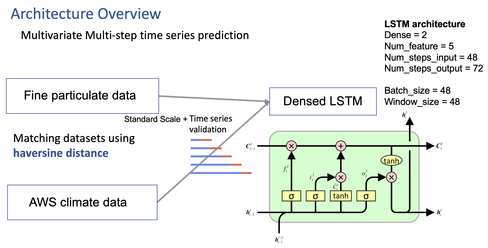

# 2023_AI_Spark_Air_Pollution_Prediction  
AI solution that Predict of Air Pollution by region

## Solution Overview


## Team member  
|
|-|
|[Jiyul Ham](https://github.com/YUL-git)

## File Structure
```
┖ figures
  ┖ ~
┖ Densed_LSTM.ipynb
┖ Datasets
  ┖ TRAIN
    ┖ ~
  ┖ TRAIN_AWS
    ┖ ~
  ┖ TEST
    ┖ ~
  ┖ TEST_AWS
    ┖ ~
  ┖ Meta_data
  ┖ Sample_submission

```
  
Densed_LSTM.ipynb  
- Train and Test the Densed Lstm model

## Submission Process  
Run All code in 'Densed_LSTM.ipynb' to predict air pollution
